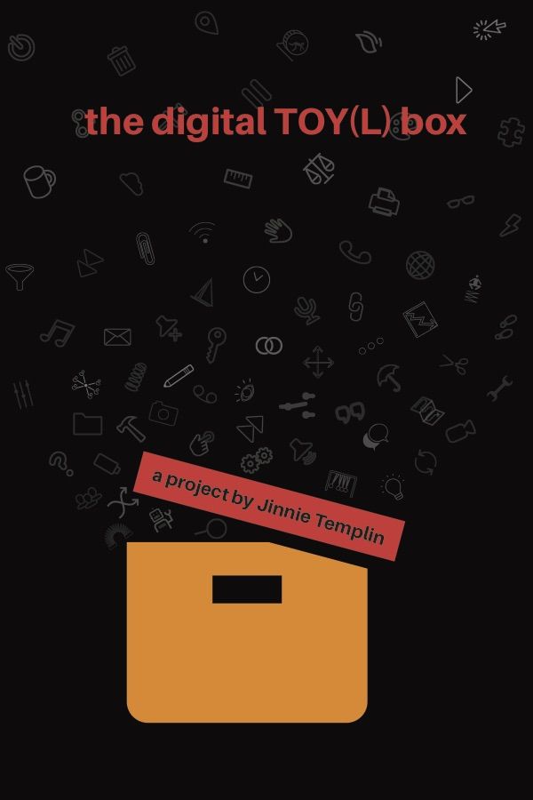

# Open up your digital TOY(L) box

Building off of the concept of free imaginative play, the digital TOY(L) box aims to address various work tasks in a more playful manner. It is a series of open source TOY(L) prototypes that aim to act as conversation starters between and within individuals to help them reframe their thoughts about work. TOY(L)S achieve function like tools and are a catalyst for fun like toys.

Equipping the modern worker with a digital TOY(L) box may encourage even the most tedious and mundane work tasks to become playful experiences in creative problem solving and innovation. By exploring the intersection of workspace and playspace, new methods of incorporating playfulness into work tasks can help workers feel more engaged with their work, ultimately making them feel happier, healthier, and more fulfilled.

In the digital TOY(L) box you'll find:
- workToy, a desktop encouraging playful behavior
- workMats, desktop mats that transform the way you interact with your digital devices
- HAB LIBS, a MAD LIBS inspired app for commonly sent emails

I invite you to take these ideas and explore them; make them your own.

**Transform your workspace. Transform your work. Be playful always.**

You can find code used to create these TOY(L)S in this repository. Check out the README files in each project for pointers. For more information about the projects, as well as ideas for desiging your own TOY(L)S, check out the project's site at http://jintemp.com/creations/digital-toyl-box/

