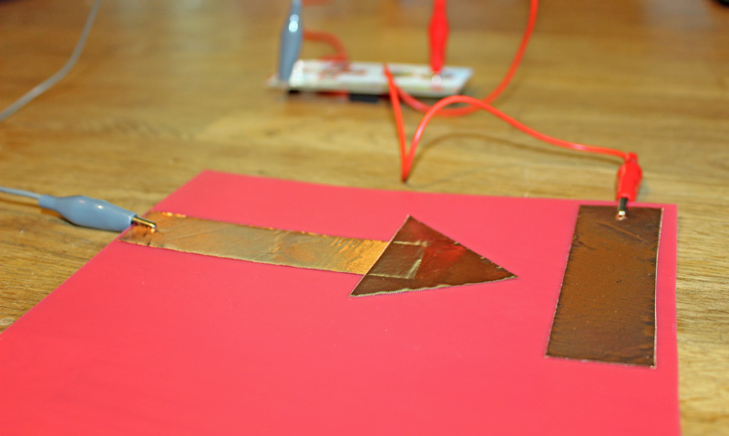

Thanks for checking out workMats, mats that transform the way you interact with your digital devices and give play dough a use on the desktop.

The code in this repository can be used to remap the Makey Makey. Earlier versions of the Makey Makey can be remapped online at http://makeymakey.com/remap/

For more information about workMats, including video and tips for making your own workMats, visit http://jintemp.com/creations/digital-toyl-box/workmat/. Use the contact form to get in touch with Jinnie if you have any questions.