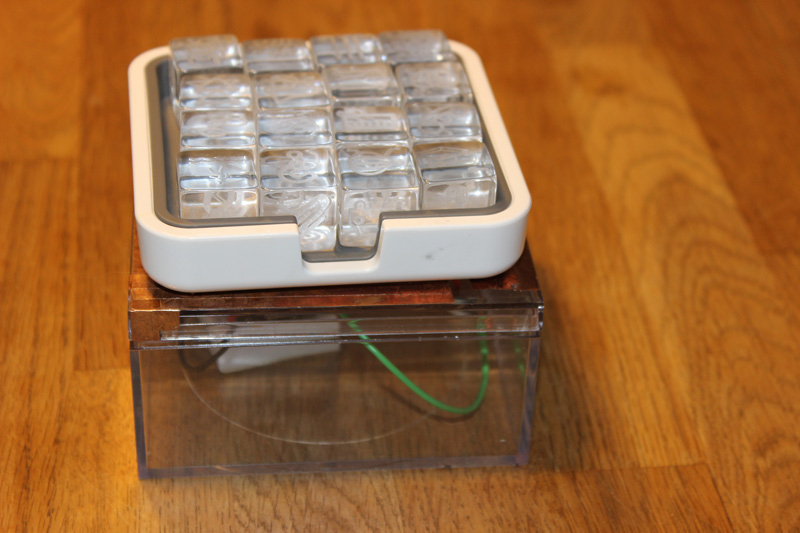

Thanks for checking out workToy, a desktop TOY(L) that encourages playful behavior. workToy was designed to foster a dialogue, both internally and with others, about work and play habits, by using data to help workers become more aware of their workspace habits.

For more information about workToy, visit http://jintemp.com/creations/digital-toyl-box/worktoy-2/. Use the contact form to get in touch with Jinnie if you have any questions.

#### **To make your own workToy:**
Check out the suggested materials and basic instructions on the workToy project page at http://jintemp.com/creations/digital-toyl-box/worktoy-2/. 

After constructing a workToy of your own, you can use this code to program your Paricle (formerly Spark) Core wi-fi enabled microcontroller. Directions for setting up a Core can be found here: http://docs.particle.io/core/. **NOTE**: it is probably easiest to setup the device on your home wi-fi network, so you have access to the network permissions for troubleshooting. 

#### **To upload the code to your Particle Core:**
1. Login to your Particle (formerly Spark) account and create a new app at build.particle.io
2. Copy and paste the contents of the workToy.ino file in this repository into the app's code editor area. 
3. Verify and save the code before flashing to your Core. 
	- The Core may need to be reset in order to flash successfully, depending on the firmware it is already running. Resetting the Core may help resolve issues with flashing. 
